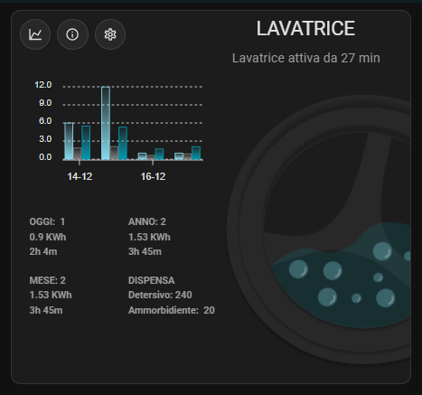
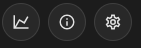
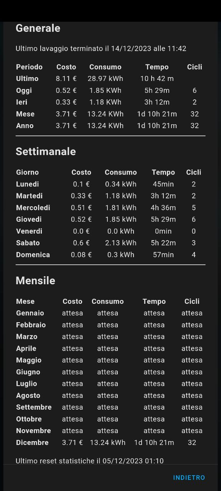
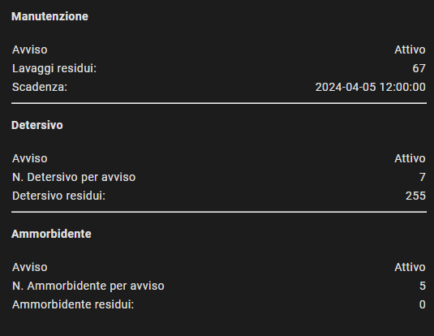
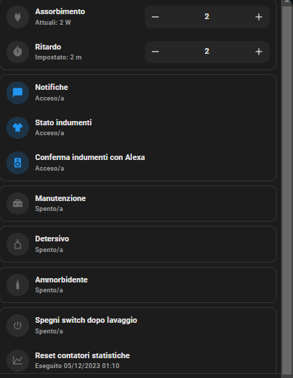
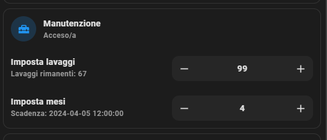
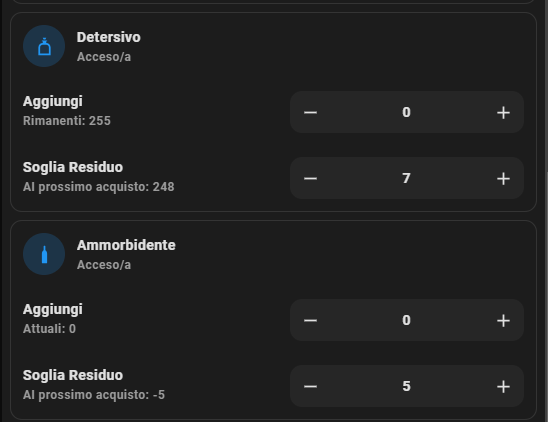
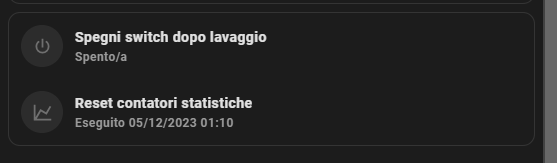

`- Version: 1.1 -`

### **Supportaci**

Se hai apprezzato questo progetto, ci piacerebbe avere il tuo supporto. Anche un semplice caffè può fare la differenza.
I fondi raccolti saranno utilizzati per acquistare nuovo materiale e realizzare nuovi progetti. Puoi contribuire cliccando sul pulsante qui sotto.
Grazie di cuore per il tuo sostegno!

[](https://ko-fi.com/M4M1MI00I)

# Smart Laundry System - Lavatrice

https://github.com/Home-Assistant-Pro-Team/Smart-Laundry-System---Lavatrice/assets/62516592/d6b174b3-f2ec-4e73-b012-b86a043c506e

## **Indice**

- [Introduzione](#introduzione)
- [Requisiti](#requisiti)
- [Funzionalità](#funzionalità)
- [Installazione](#installazione)
- [Info Card](#info-card)
- [Change Log](#change-log)

## **Introduzione**

Benvenuto al nuovo capitolo dedicato agli elettrodomestici, con un focus speciale sulla lavatrice, uno degli elettrodomestici più comuni. In questo pacchetto, oltre a fornire statistiche dettagliate, ci immergeremo in un approccio avanzato alle notifiche, presentando anche una nuova card.




## **Requisiti**

- [HomeAssitant release 2023.12.1](https://www.home-assistant.io/blog/2023/12/06/release-202312/)
- [Cartella Package abilitata](https://www.home-assistant.io/docs/configuration/packages/)
- [Shopping list](https://www.home-assistant.io/integrations/shopping_list/)
- [Hacs](https://hacs.xyz/)
  - [Browser mod](https://github.com/thomasloven/hass-browser_mod)
  - [Apexcharts-card](https://github.com/RomRider/apexcharts-card)
  - [Card mod](https://github.com/thomasloven/lovelace-card-mod)
  - [button-card](https://github.com/custom-cards/button-card)
  - [Mushroom](https://github.com/piitaya/lovelace-mushroom)
  - [Vertical stack in card](https://github.com/ofekashery/vertical-stack-in-card)
- Dispositivo per controllo assorbimento es. shelly1pm o plugs

## Funzionalità

### 1. Stato Lavatrice

Il sistema monitora attentamente lo stato della lavatrice, offrendo informazioni dettagliate come:

- In esecuzione
- Terminata con indumenti da ritirare
- Terminata in attesa di un nuovo lavaggio

### 2. Notifiche fine lavaggio

Le notifiche al termine del ciclo di lavaggio sono progettate per offrire un'esperienza completa, tenendo conto della presenza in casa e personalizzando le notifiche in base a vari scenari.

- **Modalità di Notifica:** Riceverai notifiche push, tramite Alexa e Google, per essere sempre aggiornato sulla conclusione del lavaggio.

- **Gestione della Presenza:**
  - **Media Player:** I messaggi ai media player verranno inviati solo se almeno una persona è presente in casa al termine del ciclo di lavaggio.
  - **Notifiche Push Selettive:** Le notifiche push saranno inviate solo alle persone presenti in casa al momento della notifica. Se nessuno è presente, la notifica sarà inviata a tutti.

- **Riproduzione Media Player al Rientro:**
  - Nel caso in cui la lavatrice termini il ciclo mentre nessuno è in casa, al ritorno della prima persona, riceverà una notifica push e i media player inizieranno la riproduzione.

- **Conferma Ritiro Panni (Opzionale):**
  - Se configurato con [Alexa Actionable Notification](https://indomus.it/progetti/home-assistant-e-le-notifiche-azionabili-di-amazon-alexa/), 5 minuti dopo la notifica Media Player di fine lavaggio, una Alexa casuale richiederà la conferma sul ritiro dei panni.
  - Questa richiesta verrà ripetuta ogni 5 minuti fino a quando non viene confermato il ritiro dei panni. La conferma può avvenire rispondendo sì ad Alexa, tramite action alla notifica push, interfaccia grafica o se la lavatrice ha avviato un nuovo ciclo di lavaggio.

### 3. Stato Ammorbidente e Detersivo (Opzionale)

- **Monitoraggio Costante:** Ricevi notifiche quando la quantità di ammorbidente o detersivo raggiunge la soglia di rifornimento.
- **Gestione Shopping List:** I prodotti esauriti vengono automaticamente aggiunti alla shopping list per un comodo rifornimento.
- **Inserimento Quantità Acquistata:** Dopo l'acquisto, ricevi notifiche con azioni per inserire la quantità effettivamente acquistata. Queste notifiche vengono eliminate automaticamente per evitare duplicazioni quando si aggiorna la quantità dei consumabili acquistati, garantendo un processo senza duplicazioni e una gestione efficiente delle notifiche.

### 4. Stato Manutenzione (Opzionale)

- **Promemoria Pulizia Filtro:** È possibile impostare un periodo espresso in mesi o lavaggi per ricevere una notifica push che ricorda di eseguire la pulizia del filtro.
- **Reset Contatore:** Al verificarsi delle condizioni impostate, il contatore di manutenzione viene azzerato, garantendo che i mesi e i cicli siano reimpostati secondo le nuove impostazioni per le notifiche successive.

### 5. Statistiche

- **Dettagliate e Istantanee:** Tieni sotto controllo ogni dettaglio del tuo lavaggio, dalle informazioni istantanee sul consumo energetico alla durata dell'ultimo ciclo e allo stato corrente del lavaggio. Ottieni una panoramica completa dei costi e dei consumi associati.

- **Statistiche Temporali:** Esplora dettagliate statistiche temporali per ottenere una visione completa delle tue abitudini di lavaggio. Analizza i dati giorno per giorno e mese per mese. Le informazioni sono suddivise in singoli giorni della settimana, mesi specifici e interi anni, offrendoti un'analisi temporale dettagliata.

- **Reset Personalizzati:** Hai il controllo totale sulla gestione dei dati. Azzera facilmente i valori che desideri direttamente dall'interfaccia, personalizzando la tua esperienza di monitoraggio delle statistiche.

## Installazione

La struttura del pacchetto è organizzata in diverse cartelle.

##### 1. Custom template

Nel caso non sia già presente, la prima operazione da compiere è il caricamento della cartella "custom_templates" nella directory "config", o, in alternativa, l'inserimento dei singoli file al suo interno.

- **personal.jinja**
    Questo file è utilizzato per altri progetti all'interno di questo repository GitHub. Nel file, impostiamo dati personali che verranno utilizzati in tutti i progetti. È sufficiente inserire le proprie entità rispettando l'indentazione JSON.

    Vediamo come personalizzarlo. Anche se non tutte le informazioni sono necessarie per questo pacchetto, è consigliabile compilare tutti i campi per poter sfruttarlo appieno in altri progetti.

    In questa sezione, definiamo le entità e i sensori per ogni persona. Se non si desidera associare un numero di cellulare o un sensore di sveglia a una persona specifica, è sufficiente assegnare il valore "none" nella sezione corrispondente del file. Per aggiungere o rimuovere persone dalla lista di dizionari, è necessario prestare attenzione alla sintassi JSON.

    ```
    
    [
        {
            "person": "person.marco",
            "battery": "sensor.cellulare_marco_battery_level",
            "notify": "mobile_app_cellulare_marco",
            "sveglia": "sensor.cellulare_marco_prossimo_allarme",
            "cellulare": "331000000"
        },
        {
            "person": "person.serena",
            "battery": "sensor.cellulare_serena_livello_della_batteria",
            "notify": "mobile_app_samsung_s21",
            "sveglia": "none",
            "cellulare": "335000000"
        }
    ]
    
    ```

    In questa sezione, elencheremo i nostri media player utilizzati per le notifiche. Assicurati di inserire correttamente i media player selezionati per le notifiche Alexa e TTS (ad esempio, Google), seguendo attentamente la sintassi corretta.

    ```
    
        
        
            {{ integrations }}
        
    
    ```

##### 2. Packages

- Copia la cartella "elettrodomestici" e incollala all'interno della directory "packages".
- Apri il file "lavatrice.yaml".
- Modifica gli ancoraggi (switch e power) presenti con le tue entità personali. E riavvia il sistema.

Esempio di modifica all'interno del file "lavatrice.yaml":

```
homeassistant:
customize:
    package.node_anchors:
    switch: &switch switch.lavatrice1pm
    power: &power sensor.lavatrice1pm_power
```

##### 3. Creazione Card

Per creare la card, segui questi passaggi:

1. Copia il contenuto del file "card.txt".
2. Accedi alla tua dashboard.
3. Crea una nuova card manualmente.
4. Incolla il contenuto copiato nella sezione appropriata.

Ora dovresti visualizzare la card con tutte le informazioni sulla lavatrice sulla tua dashboard.

## Info Card

La nostra card è stata progettata per adattarsi senza sforzi a dispositivi mobili e desktop, fornendo un modo rapido e accessibile per tenere traccia dello stato della lavatrice. Con un'animazione SVG personalizzata, otterrai una visione immediata delle attività in corso, rendendo il monitoraggio della lavatrice un'esperienza intuitiva.


La card offre una panoramica dettagliata delle attività della lavatrice con un grafico intuitivo che riepiloga gli ultimi 4 giorni, fornendo informazioni sul tempo di funzionamento, consumo energetico e numero di lavaggi. Ulteriori dettagli statistici sono disponibili per il giorno corrente, il mese e l'anno, offrendo una visione approfondita delle abitudini di utilizzo. Inoltre, per consentire un accesso rapido e diretto a ulteriori informazioni, la card è dotata di tre tasti dedicati.



- Il primo pulsante apre un popup che offre un accesso immediato alle statistiche storiche della lavatrice, eliminando la necessità di utilizzare un recorder.
    
- Il secondo pulsante apre un popup con informazioni sulla scadenza della manutenzione e lo stato dei detersivi e ammorbidenti rispetto alle soglie di avviso impostate.
    
- Il terzo pulsante apre un popup dedicato alle impostazioni del pacchetto.
    
  - **Assorbimento**: Questa è la soglia espressa in watt oltre la quale la lavatrice viene considerata accesa.
  - **Ritardo**: Questo è il periodo di tempo espresso in minuti. Dopo questo periodo, se la lavatrice scende sotto la soglia di assorbimento precedentemente impostata, viene considerata spenta.
  - **Notifiche**: Attivando questa opzione, è possibile abilitare le notifiche. na volta abilitato, si apre la possibilità di monitorare lo "Stato Indumenti".
  - **Stato Indumenti**: Attivando questa opzione, è possibile monitorare e ricevere conferme tramite la card e notifiche push riguardo al ritiro dei panni.
  - **Conferma Indumenti Alexa**: Abilitando questa funzione, si ottiene la possibilità di confermare il ritiro dei panni anche attraverso il dispositivo Alexa, come precedentemente descritto.
  - **Manutenzione**: Attivando questa funzione, è possibile impostare il numero di mesi e di lavaggi trascorsi prima di ricevere un promemoria per pulire il filtro della lavatrice.
    
  - **Detersivo/Ammorbidente**:  Attivando questi servizi in modo indipendente, si ottiene la possibilità di impostare la soglia di acquisto e tenere traccia delle quantità acquistate per entrambi.  
    
  - **Spegni switch**: Se attivato, questo opzione spegne lo switch collegato alla lavatrice al termine del lavaggio.
  - **Reset contatori statistiche**: Questo pulsante consente di azzerare tutte le statistiche presenti nella card.
    

## **Change Log**

##### Versione: 1.1

- Per passaggio alla nuova versione basta sostituire il file lavatrice.yaml (le statistiche non verranno perse)
- Le statistiche per singolo mese e singolo giorno della settimana si aggiornano in modo istanteneo e non ogni ora.
- Eliminato sensor.stato_lavatrice e sosituito nello stato del sensor.storico_lavatrice.

## **Supportaci**

Siamo aperti a contributi! Fornisci feedback, segnala problemi o invia una pull request per migliorare il progetto.

Se hai apprezzato questo progetto, ci piacerebbe avere il tuo supporto. Anche un semplice caffè può fare la differenza.
I fondi raccolti saranno utilizzati per acquistare nuovo materiale e realizzare nuovi progetti. Puoi contribuire cliccando sul pulsante qui sotto.
Grazie di cuore per il tuo sostegno!

[](https://ko-fi.com/M4M1MI00I)
